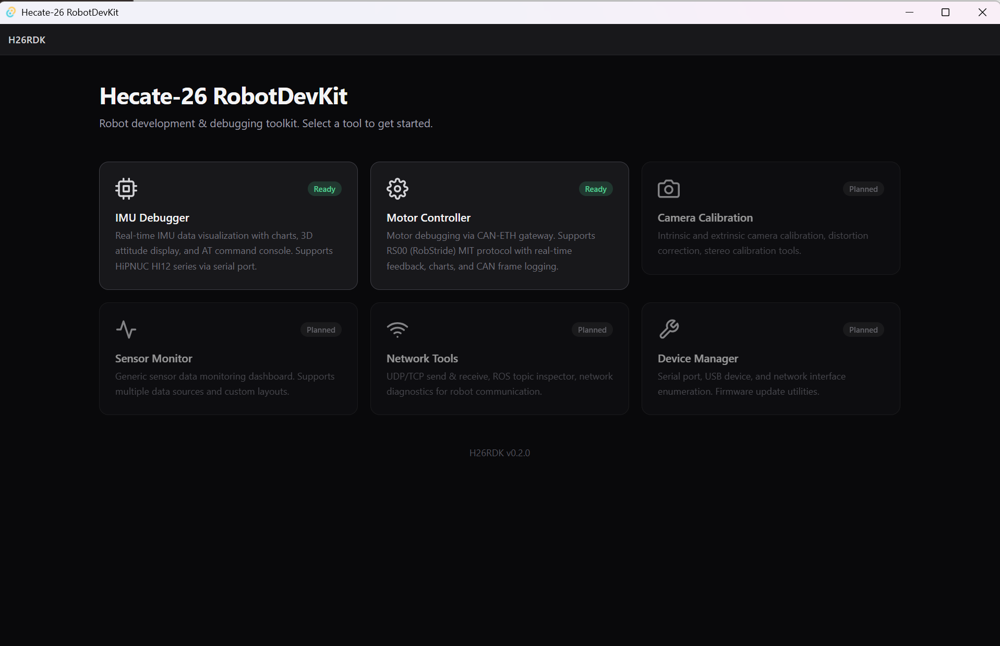
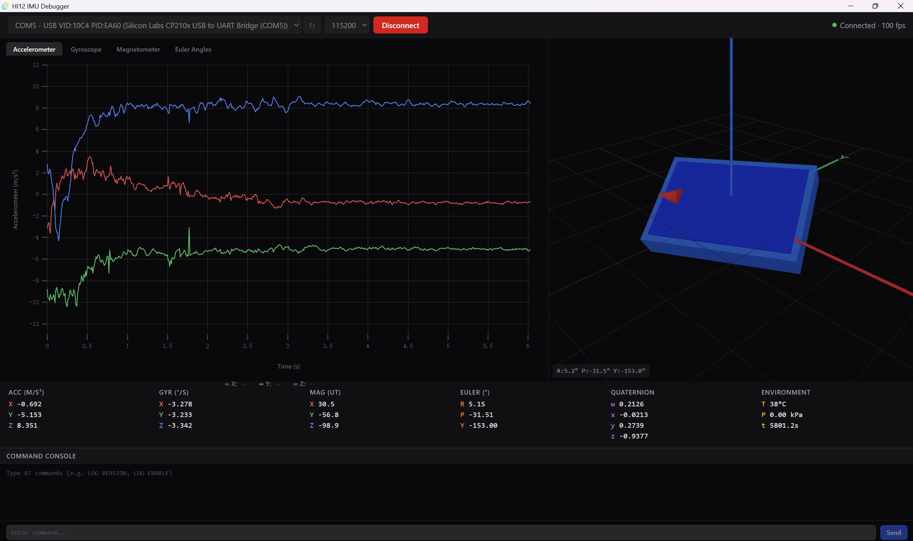
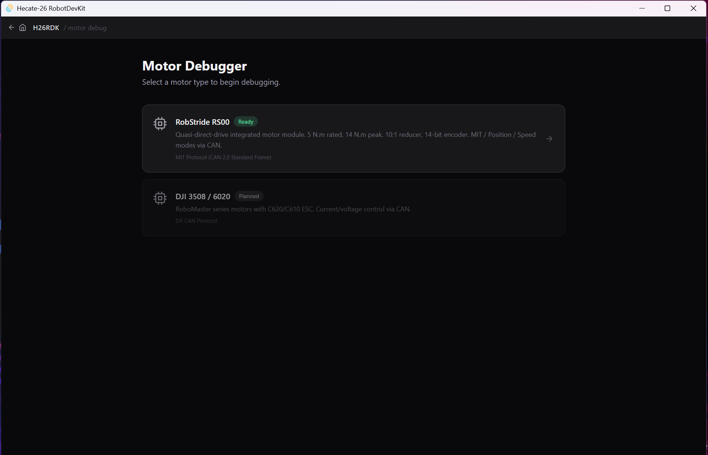
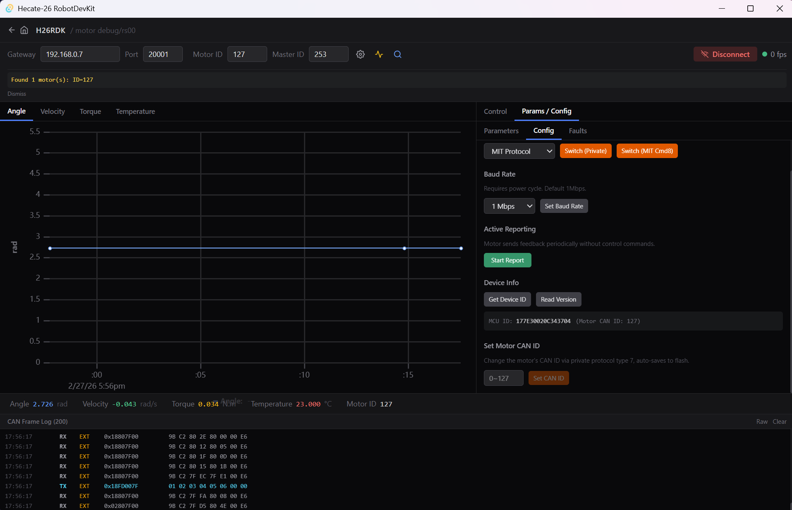

# Hecate-26 RobotDevKit (H26RDK)

[中文](./README.md) | **English**

A cross-platform (Windows / Linux) robot debugging toolkit built with **Tauri v2 + React 19 + TypeScript + Rust**. Originally developed for **steering-wheel robots (舵轮机器人)**, it is designed to be a universal debugging suite for any motor-driven robot platform.

Currently features two core modules:
- **IMU Debugging** — HiPNUC HI12 series 9-axis IMU real-time visualization
- **Motor Debugging** — **LingZu (灵足时代) RS00** series CAN servo motor control & diagnostics


---

## Why H26RDK for RS00 Motor Debugging?

Most CAN motor debugging tools require a **USB-CAN adapter (CAN 盒)** and vendor-specific Windows-only software. H26RDK takes a different approach:

| Feature | H26RDK | Traditional Tools |
|---------|--------|-------------------|
| **CAN interface** | Ethernet gateway (Waveshare CAN-TO-ETH) — no driver install, plug-and-play | USB-CAN adapter — requires proprietary driver |
| **Platform** | **Windows + Linux** | Windows only |
| **CAN ID unknown?** | **Full-range scan (0~127)** — auto-detect and auto-connect | Must know CAN ID in advance |
| **Protocol switching** | Switch between MIT ↔ Private protocol **without disconnecting** | Typically locked to one protocol mode |
| **MIT + Private coexistence** | Send MIT commands while reading private protocol parameters — no conflict | Official upper computer may refuse connection under MIT mode |
| **Set CAN ID remotely** | Change motor CAN ID via software, auto-save to Flash | Requires physical access or separate tool |
| **Open source** | Fully open source, hackable | Closed source |

---

## Screenshots

<table>
  <tr>
    <td align="center"><strong>Home Page</strong><br></td>
    <td align="center"><strong>IMU Debugging</strong><br></td>
  </tr>
  <tr>
    <td align="center"><strong>Motor Type Selection</strong><br></td>
    <td align="center"><strong>RS00 Motor Debugging</strong><br></td>
  </tr>
</table>

---

## Feature Overview

### IMU Debugging Module

| Feature | Description |
|---------|-------------|
| Serial connection | Auto-enumerate ports, auto-detect CP210x (VID:10C4 PID:EA60), 4800~921600 baud |
| Protocol parsing | Rust backend real-time HiPNUC binary protocol (HI91) decoding with CRC16 validation |
| Data dashboard | Accelerometer, gyroscope, magnetometer, Euler angles, quaternion, temperature, pressure |
| Real-time charts | uPlot high-performance scrolling curves — 4 switchable views |
| 3D attitude | Three.js quaternion-driven visualization, ROS coordinate system (Z-up) |
| AT command console | Send AT commands (LOG ENABLE/DISABLE, baud rate config, firmware query, etc.) |

### Motor Debugging Module (LingZu RS00)

| Feature | Description |
|---------|-------------|
| **Gateway-based CAN** | Connect via Waveshare 2-CH CAN-TO-ETH gateway over UDP — no USB-CAN adapter needed |
| **CAN ID auto-scan** | Scan full range (0~127), **auto-detect and auto-connect** to motors with unknown CAN IDs |
| **MIT protocol** | Mixed position/velocity/torque control with Kp/Kd gains, real-time slider adjustment |
| **Private protocol** | Position / Speed / Current(Torque) / Impedance / Position-Speed modes with auto-reporting |
| **Protocol switching** | Switch between MIT and Private protocol modes on-the-fly without reconnecting |
| **Real-time feedback** | Angle, velocity, torque waveform charts from motor feedback frames |
| **CAN frame log** | Live TX/RX CAN frame inspector with pause and clear |
| **Parameter management** | Read/write motor parameters (current limit, speed limit, PID, filter gain, acceleration, etc.) |
| **Flash save/restore** | Save parameters to Flash, restore factory defaults |
| **Remote CAN ID change** | Modify motor CAN ID via software with automatic Flash save and backend sync |
| **Device diagnostics** | Read MCU Device ID (96-bit unique identifier) and firmware version |

---

## Quick Start

### Pre-built Release (Windows)

1. Download the latest release from [Releases](https://github.com/ALUnit7/Hecate-26-RobotDevKit/releases)
2. Run the `.exe` installer or portable executable
3. **For IMU**: Install [CP210x USB-UART driver](https://www.silabs.com/developers/usb-to-uart-bridge-vcp-drivers)
4. **For Motor**: Connect [Waveshare 2-CH CAN-TO-ETH](https://www.waveshare.com/2-ch-can-to-eth.htm) gateway to your network
5. Windows 10 users: Install [WebView2 Runtime](https://developer.microsoft.com/en-us/microsoft-edge/webview2/) (pre-installed on Windows 11)

### Motor Quick Connect

1. Power on the RS00 motor and connect it to the CAN-TO-ETH gateway
2. Open H26RDK → Motor Debug → RS00
3. Enter gateway IP (default `192.168.0.7`) and port (default `20001`)
4. Click **Connect**
5. **Don't know the motor's CAN ID?** Click the **Scan** button (🔍) — H26RDK scans all 128 addresses (0~127) and **automatically connects** to the first motor found
6. Switch between MIT / Private protocol tabs and start controlling

---

## Build from Source

### Windows

**Prerequisites:**

```powershell
# 1. Node.js >= 20 LTS (https://nodejs.org/)
node --version

# 2. pnpm >= 9
npm install -g pnpm

# 3. Rust stable (https://rustup.rs/)
rustc --version

# 4. MSVC Build Tools — "Desktop development with C++" workload
#    (https://visualstudio.microsoft.com/visual-cpp-build-tools/)
```

**Build:**

```powershell
git clone https://github.com/ALUnit7/Hecate-26-RobotDevKit.git
cd Hecate-26-RobotDevKit
pnpm install
pnpm tauri build
```

Output:
- `src-tauri/target/release/hecate26-robot-devkit.exe`
- `src-tauri/target/release/bundle/nsis/*-setup.exe` (NSIS installer)
- `src-tauri/target/release/bundle/msi/*.msi` (MSI installer)

### Linux (Ubuntu / Debian)

**1. Install system dependencies:**

```bash
sudo apt update
sudo apt install -y \
  build-essential \
  curl \
  wget \
  file \
  libssl-dev \
  libgtk-3-dev \
  libayatana-appindicator3-dev \
  librsvg2-dev \
  libwebkit2gtk-4.1-dev \
  libudev-dev \
  pkg-config
```

> `libudev-dev` — required by the `serialport` Rust crate
> `libwebkit2gtk-4.1-dev` — Tauri v2 WebView backend on Linux

**2. Install Node.js (>= 20 LTS):**

```bash
curl -o- https://raw.githubusercontent.com/nvm-sh/nvm/v0.40.3/install.sh | bash
source ~/.bashrc
nvm install 20
nvm use 20
```

**3. Install pnpm:**

```bash
npm install -g pnpm
```

**4. Install Rust:**

```bash
curl --proto '=https' --tlsv1.2 -sSf https://sh.rustup.rs | sh
source "$HOME/.cargo/env"
```

**5. Clone and build:**

```bash
git clone https://github.com/ALUnit7/Hecate-26-RobotDevKit.git
cd Hecate-26-RobotDevKit
pnpm install
pnpm tauri build
```

Output (in `src-tauri/target/release/bundle/`):
- `deb/*.deb` — Debian package
- `appimage/*.AppImage` — Universal Linux executable
- `rpm/*.rpm` — RPM package (if applicable)

**Dev mode** (hot-reload):

```bash
pnpm tauri dev
```

---

## Architecture

```
┌──────────────────────────────────────────────────────────────┐
│                     React 19 Frontend                        │
│  ┌──────────┐  ┌──────────┐  ┌──────────┐  ┌──────────────┐ │
│  │ HomePage │  │IMU Debug │  │Motor Sel │  │ RS00 Debug   │ │
│  │ (router) │  │ (serial) │  │ (select) │  │ (UDP/CAN)    │ │
│  └──────────┘  └──────────┘  └──────────┘  └──────────────┘ │
│               Zustand Store + 60fps RAF Throttle             │
└──────────────────────────┬───────────────────────────────────┘
                           │ Tauri IPC Events
┌──────────────────────────┴───────────────────────────────────┐
│                       Rust Backend                           │
│  serial.rs (USB-UART)    │  udp.rs (UDP → CAN gateway)      │
│  ├─ list / open / close  │  ├─ connect / disconnect          │
│  ├─ read thread          │  ├─ MIT / Private protocol        │
│  └─ AT commands          │  ├─ param read / write / save     │
│                          │  ├─ CAN ID scan (0~127)           │
│  protocol.rs (HiPNUC)   │  └─ device ID / firmware query    │
│  ├─ CRC16-CCITT          │                                   │
│  ├─ HI91 decode          │  motor_protocol.rs                │
│  └─ state machine        │  ├─ MIT frame encode / decode     │
│                          │  ├─ Private protocol frames       │
│  state.rs                │  └─ parameter definitions         │
│  └─ shared state         │                                   │
└──────────────────────────┴───────────────────────────────────┘
        │                              │
  USB-UART (CP210x)         UDP (Waveshare CAN-TO-ETH)
        │                              │
   [ HI12 IMU ]             [ LingZu RS00 Motor ]
```

| Layer | Technology | Purpose |
|-------|-----------|---------|
| Desktop framework | Tauri v2 | Native window, Rust backend, IPC |
| Frontend | React 19 + TypeScript | Component-based UI with routing |
| Build tool | Vite 7 | Dev server + production build |
| Styling | Tailwind CSS v4 | Atomic CSS, dark theme |
| Charts | uPlot | High-performance real-time time-series |
| 3D | Three.js + react-three-fiber | Quaternion-driven attitude visualization |
| State | Zustand 5 | Lightweight reactive store |
| Serial | Rust `serialport` crate | Native serial I/O |
| Network | Rust `std::net::UdpSocket` | UDP transparent CAN frame relay |

---

## Development

```bash
pnpm install          # Install dependencies
pnpm tauri dev        # Dev mode (hot-reload)
pnpm tauri build      # Production build

cd src-tauri
cargo test            # Run Rust unit tests (21 tests)
```

### Project Structure

```
src-tauri/src/
├── main.rs              # Tauri entry point
├── lib.rs               # Plugin + command registration
├── protocol.rs          # HiPNUC protocol parser (CRC16, HI91, unit tests)
├── serial.rs            # Serial port management
├── state.rs             # Shared state
├── udp.rs               # UDP/CAN communication (MIT + Private + params + diagnostics)
└── motor_protocol.rs    # Motor protocol definitions (MIT/Private frames, param table)

src/
├── main.tsx             # Router setup
├── App.tsx              # Root layout + navbar
├── pages/
│   ├── HomePage.tsx                     # Module selection home
│   ├── imu-debug/ImuDebugPage.tsx       # IMU debugging page
│   └── motor-debug/
│       ├── MotorSelectPage.tsx          # Motor type selection
│       └── rs00/RS00DebugPage.tsx       # RS00 motor debugging page
├── stores/
│   ├── imu-store.ts                     # IMU state
│   └── motor-store.ts                   # Motor state
├── hooks/
│   ├── use-imu-data.ts                  # IMU event listener + 60fps throttle
│   └── use-motor-data.ts               # Motor event listener + feedback
├── components/
│   ├── layout/AppNavbar.tsx             # Top navigation bar
│   ├── toolbar/ConnectionToolbar.tsx    # IMU serial toolbar
│   ├── dashboard/DataDashboard.tsx      # IMU numeric dashboard
│   ├── charts/RealtimeChart.tsx         # IMU real-time charts
│   ├── viewer3d/AttitudeViewer.tsx      # 3D attitude viewer
│   ├── console/CommandConsole.tsx       # AT command console
│   └── motor/
│       ├── MotorToolbar.tsx             # Motor connection toolbar
│       ├── MotorControlPanel.tsx        # MIT / Private control panel
│       ├── MotorChart.tsx               # Motor feedback charts
│       ├── MotorParamsPanel.tsx         # Parameter read/write panel
│       └── MotorCanLog.tsx              # CAN frame log
└── types/
    ├── imu.ts                           # IMU data types
    └── motor.ts                         # Motor data types
```

---

## Roadmap

### Coming Soon

- [ ] **MIT high-frequency oscilloscope mode** — Continuous high-rate MIT command loop with real-time waveform capture, enabling oscilloscope-like motor response analysis (step response, frequency sweep, PID tuning visualization)
- [ ] **Native protocol control** — Direct raw CAN frame composition and sending, enabling low-level motor register access and custom protocol experimentation
- [ ] **Multi-motor control** — Simultaneous control of multiple motors on the same CAN bus with synchronized command dispatch
- [ ] **Data recording & export** — Record motor feedback and IMU data to CSV/JSON for offline analysis (backend already implemented, UI integration pending)

### Planned

- [ ] **Serial response display** — Route AT command ASCII responses back to console
- [ ] **Disconnect detection** — USB unplug detection + auto-reconnect
- [ ] **0x3xxx readonly parameters** — Full parameter read support pending RS00 firmware ≥ 0.0.3.5
- [ ] **More motor types** — Extend motor debugging module to support additional CAN servo motors
- [ ] **Data replay** — Import recorded CSV and replay on charts / 3D viewer
- [ ] **Chart enhancements** — Pause/resume, Y-axis lock, hover tooltips, configurable time window
- [ ] **macOS support** — Test and validate macOS build
- [ ] **i18n** — Chinese / English interface toggle

---

## License

MIT
